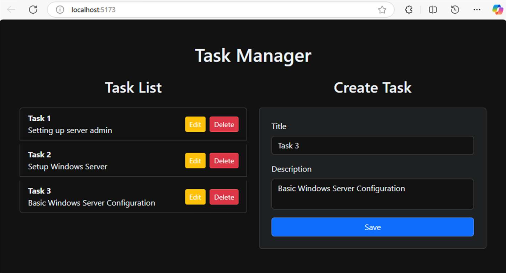

# MongoDB_WebApp_Simple_CRUD
Web Application with MongoDB and Simple CRUD test cases

# CRUD with Nodejs, Express and Mongodb



This is a Multi page application using nodejs mongodb and vuejs using vite


### Installation (Manually)

#### Requirements

* You need mongodb installed and running on your computer. Also, see [MongoDB_Compass_Setup](./task-manager-frontend/MongoDB_Compass_Setup.pdf) for your additional reference. 

```bash
$ git clone https://github.com/cbatuic/MongoDB_WebApp_Simple_CRUD$

# Terminal 1
$ cd task-manager
$ npm install
$ node server.js

# Terminal 2
$ cd task-manager-frontend
$ npm install
$ npm run dev
```

Now you can visit: <a target="_blank" href="http://localhost:5173">http://localhost:5173</a>. Note that, replace the localhost using your server's ip address.

